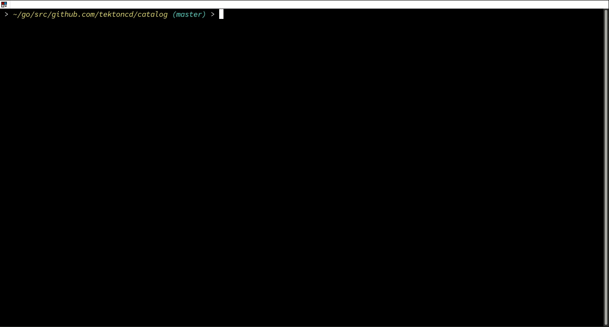

# :cat: Catlin :cat:

Catlin is a command-line tool that Lints Tekton Resources and Catalogs.

It validates the resources on the basis the Tekton catalog structure defined in the [TEP][tep].



## Commands

### Validate

This command validates
- If the resource is in valid path
- If the resource is a valid Tekton Resource
- If all mandatory fields are added to the resource file
- If all images used in Task Spec are tagged
- If platforms are specified in correct format
```
catlin validate <path-to-resource-file>
```

### Bump

This command bumps the version of an existing resource in the catalog.
After running this command a new version of the given resource will be
created in its own directory and the latest version of that resource
will be copied into it, ready for editing.

```
catlin bump <path-to-resource-directory>
```

This example bumps the version of git-clone:

```bash
$ catlin bump task/git-clone
Copying task/git-clone/0.5 to task/git-clone/0.6
```

[tep]:https://github.com/tektoncd/community/blob/main/teps/0003-tekton-catalog-organization.md
